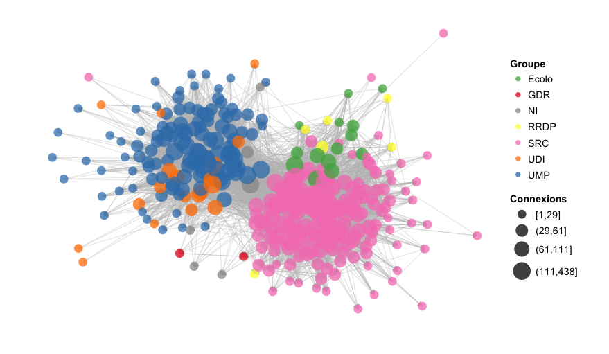

# ggnet: simple network plots with ggplot2

A while ago, Moritz Marbach coded the [`plotg()`][mm] function to visualize networks with `ggplot2` in R. 

Here's a slightly modified version that takes the following arguments:

		ggnet(net,                      # an object of class network
		      size = 12,                # node size
					alpha = .75,							# transparency
					arrow.size = .25,         #
					segment.size = .25,       #
		      weight.method = "sum",    # weight nodes by "degree", "indegree", "outdegree" or "none" (unweighted)
		      weight.quartiles = FALSE, # break weights to quartiles
		      node.group = NULL,        # what to color the nodes with
		      node.colors = NULL,       # what colors to use for the node classes
		      names = c("", ""),        # what to call the node color and node weight legends
		      label.nodes = FALSE,      # add vertex names in small print
		      legend.position = "right")

[mm]: http://sumtxt.wordpress.com/2011/07/02/visualizing-networks-with-ggplot2-in-r/

The function is not (yet) robust to omitting some of the options above, but as long as you have an object of class `network` with something to color the nodes, you should be fine. If you have networks objects in different classes than `network`, have a look at the [`intergraph`][ig] package to handle conversion.

[ig]: http://intergraph.r-forge.r-project.org/

Comments welcome!

# Example

A plot of Twitter connexions between 339 French MPs currently in office, colored by parliamentary groups and quartile-weighted by degree. Data assembled by scraping a few web sources in May 2013 with the help of [Jonathan Chibois][jc] and Benjamin Ooghe-Tabanou from [Regards Citoyens][rc]. Inspired by [Baptiste Coulmont][bc].

[bc]: http://coulmont.com/index.php?s=d%C3%A9put%C3%A9s
[jc]: http://laspic.hypotheses.org/
[rc]: http://www.regardscitoyens.org/
